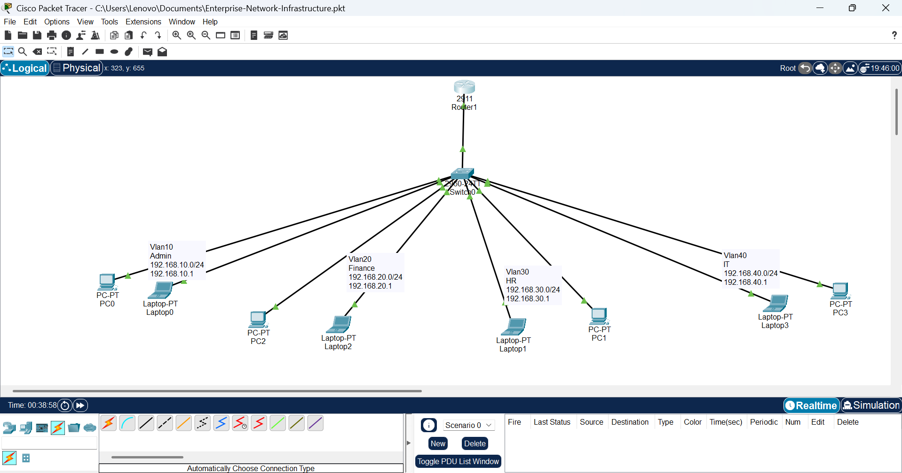

# Enterprise Network Infrastructure

## Overview

This project demonstrates the design and implementation of a small enterprise network using Cisco Packet Tracer.

The objective is to build a secure and scalable network that supports multiple departments through VLAN segmentation and Inter-VLAN Routing.

## Project Objectives

- Design an enterprise network topology
- Implement VLAN segmentation
- Configure Router-on-a-Stick
- Enable Inter-VLAN Routing
- Verify connectivity between departments
- Document network configurations and testing

## Network Topology

Departments included:

| VLAN | Department | Network         | Gateway      |
| ---- | ---------- | --------------- | ------------ |
| 10   | Admin      | 192.168.10.0/24 | 192.168.10.1 |
| 20   | Finance    | 192.168.20.0/24 | 192.168.20.1 |
| 30   | HR         | 192.168.30.0/24 | 192.168.30.1 |
| 40   | IT         | 192.168.40.0/24 | 192.168.40.1 |
| 50   | Servers    | 192.168.50.0/24 | 192.168.50.1 |

## Technologies Used

- Cisco Packet Tracer
- Cisco 2911 Router
- Cisco 2960 Switch
- VLANs
- IEEE 802.1Q Trunking
- Router-on-a-Stick
- Inter-VLAN Routing

## Current Progress

✅ VLAN segmentation for five departments (Admin, Finance, HR, IT, Servers)
✅ Router-on-a-Stick (Inter-VLAN Routing)
✅ 802.1Q Trunk Configuration
✅ Dedicated Server VLAN (VLAN 50)
✅ Centralized DHCP Server
✅ DHCP Relay using `ip helper-address`
✅ Automatic IP Address Assignment
✅ End-to-End Inter-VLAN Connectivity

### 🚧 In Progress

- Server VLAN
- DHCP
- DNS
- Web Server
- FTP Server
- SSH
- Port Security
- ACLs
- Network Hardening

## Skills Demonstrated

- Network Design
- VLAN Configuration
- Switching
- Routing
- Troubleshooting
- Network Documentation

## Author

**Banjo Oluwatobiloba Adekunle**

Aspiring Cybersecurity Analyst | ISC² CC | CompTIA Security+ | CEH Candidate

Connect with me on LinkedIn.

## Troubleshooting

### Issue: Server VLAN (VLAN 50) Connectivity

During the implementation of the Server VLAN (VLAN 50), connectivity between the router and the server initially failed.

#### Root Cause

Although VLAN 50 had been created and assigned to the server access port (Fa0/9), it was not included in the list of VLANs allowed across the trunk link between the switch and the router.

#### Resolution

The issue was resolved by updating the trunk configuration:

```bash
interface GigabitEthernet0/1
switchport trunk allowed vlan add 50
```

After verifying the trunk configuration, connectivity between the router and the server was successfully restored.

#### Verification

- Successfully pinged the server (192.168.50.2) from the router.
- Successfully pinged the server from devices in other VLANs.
- Confirmed VLAN 50 was active and forwarding on the trunk link using:

```bash
show interfaces trunk
```

## Lessons Learned

This project strengthened my understanding of:

- VLAN segmentation and network design.
- Router-on-a-Stick configuration.
- IEEE 802.1Q trunking.
- Systematic troubleshooting using Cisco IOS verification commands.
- The importance of validating configurations before making changes.
- Learned how DHCP works in enterprise networks.
- Configured a centralized DHCP server for multiple VLANs.
- Used DHCP Relay (`ip helper-address`) to forward DHCP requests across VLANs.
- Verified automatic IP assignment and successful inter-VLAN communication.

## Project Screenshots

### Enterprise Network Diagram




