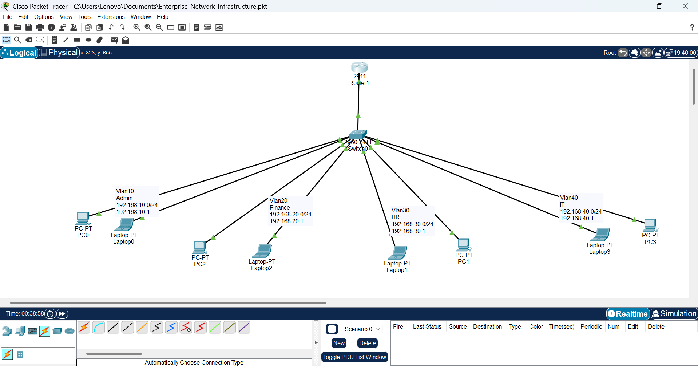
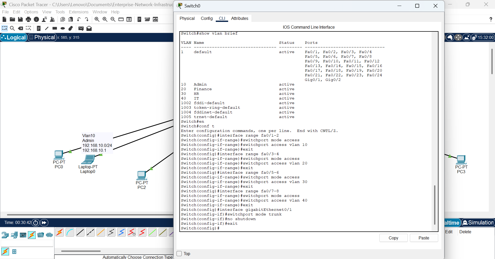
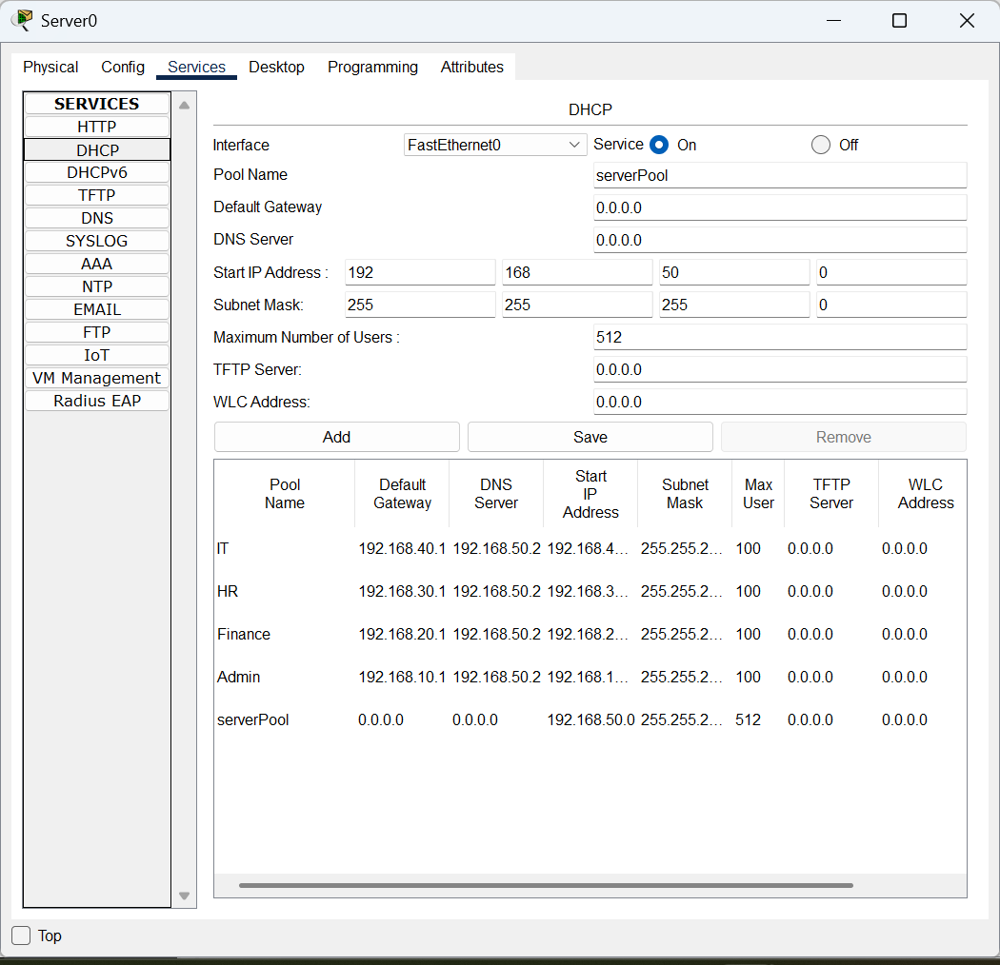
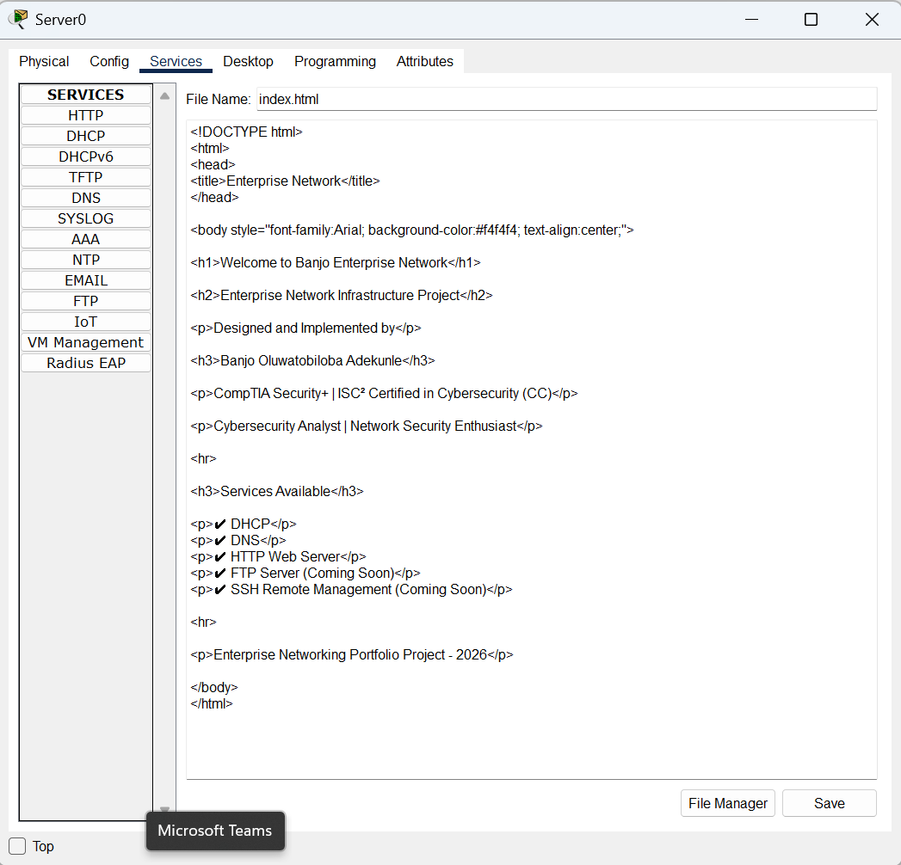

# Enterprise Network Infrastructure

## Overview

This project demonstrates the design and implementation of a secure enterprise network infrastructure using Cisco Packet Tracer. It showcases network segmentation, inter-VLAN routing, centralized network services, and foundational security controls commonly used in enterprise environments.

The objective is to build a secure and scalable network that supports multiple departments through VLAN segmentation and Inter-VLAN Routing.

## Project Objectives

- Design an enterprise network topology
- Implement VLAN segmentation
- Configure Router-on-a-Stick
- Enable Inter-VLAN Routing
- Verify connectivity between departments
- Document network configurations and testing

## Network Topology

Departments included:

| VLAN | Department | Network         | Gateway      |
| ---- | ---------- | --------------- | ------------ |
| 10   | Admin      | 192.168.10.0/24 | 192.168.10.1 |
| 20   | Finance    | 192.168.20.0/24 | 192.168.20.1 |
| 30   | HR         | 192.168.30.0/24 | 192.168.30.1 |
| 40   | IT         | 192.168.40.0/24 | 192.168.40.1 |
| 50   | Servers    | 192.168.50.0/24 | 192.168.50.1 |

## IP Addressing Scheme

| Device/Network | IP Address |
|---------------|------------|
| Router VLAN 10 Gateway | 192.168.10.1 |
| Router VLAN 20 Gateway | 192.168.20.1 |
| Router VLAN 30 Gateway | 192.168.30.1 |
| Router VLAN 40 Gateway | 192.168.40.1 |
| Router VLAN 50 Gateway | 192.168.50.1 |
| Enterprise Server | 192.168.50.2 |
| DHCP Scope VLAN 10 | 192.168.10.100-199 |
| DHCP Scope VLAN 20 | 192.168.20.100-199 |
| DHCP Scope VLAN 30 | 192.168.30.100-199 |
| DHCP Scope VLAN 40 | 192.168.40.100-199 |

## Technologies Used

- Cisco Packet Tracer 8.2.2
- Cisco 2911 Integrated Services Router
- Cisco Catalyst 2960 Switch
- VLAN Segmentation
- IEEE 802.1Q Trunking
- Router-on-a-Stick
- Inter-VLAN Routing
- DHCP
- DNS
- HTTP
- FTP

## Repository Structure

```
Enterprise-Network-Infrastructure/
│
├── README.md
├── Enterprise-Network-Infrastructure.pkt
└── Screenshots/
    ├── enterprise-network-diagram.png
    ├── vlan-configuration.png
    ├── trunk-configuration.png
    ├── router-interface-brief.png
    └── inter-vlan-routing-test.png
```

## Features Implemented

- VLAN segmentation (VLANs 10, 20, 30, 40 and 50)
- Router-on-a-Stick (Inter-VLAN Routing)
- IEEE 802.1Q Trunk Configuration
- Enterprise DHCP Server
- DHCP Relay using `ip helper-address`
- Enterprise DNS Server
- Internal HTTP Web Server
- Enterprise FTP Server
- FTP User Authentication

## Testing & Verification

The following tests were successfully completed:
- Verified communication between devices within the same VLAN.
- Verified Inter-VLAN Routing between all departments.
- Confirmed DHCP automatic IP address assignment.
- Verified DNS hostname resolution.
- Successfully accessed the internal web server using both IP address and DNS hostname.
- Successfully authenticated to the FTP server from multiple VLANs.
  
## Troubleshooting

### Issue: Server VLAN (VLAN 50) Connectivity

During the implementation of the Server VLAN (VLAN 50), connectivity between the router and the server initially failed.

#### Root Cause

Although VLAN 50 had been created and assigned to the server access port (Fa0/9), it was not included in the list of VLANs allowed across the trunk link between the switch and the router.

#### Resolution

The issue was resolved by updating the trunk configuration:

```bash
interface GigabitEthernet0/1
switchport trunk allowed vlan add 50
```

After verifying the trunk configuration, connectivity between the router and the server was successfully restored.

#### Verification

- Successfully pinged the server (192.168.50.2) from the router.
- Successfully pinged the server from devices in other VLANs.
- Confirmed VLAN 50 was active and forwarding on the trunk link using:

```bash
show interfaces trunk
```

## Current Progress

- [x] VLAN Segmentation
- [x] Inter-VLAN Routing
- [x] Server VLAN
- [x] DHCP
- [x] DNS
- [x] HTTP Server
- [x] FTP Server
- [ ] SSH
- [ ] Standard ACLs
- [ ] Extended ACLs
- [ ] Port Security
- [ ] Switch Hardening
- [ ] Syslog
- [ ] NTP
- [ ] NAT
- [ ] Final Documentation

## Lessons Learned

This project strengthened my understanding of:
- VLAN segmentation and network design.
- Router-on-a-Stick configuration.
- IEEE 802.1Q trunking.
- Systematic troubleshooting using Cisco IOS verification commands.
- The importance of validating configurations before making changes.
- Learned how DHCP works in enterprise networks.
- Configured a centralized DHCP server for multiple VLANs.
- Used DHCP Relay (`ip helper-address`) to forward DHCP requests across VLANs.
- Verified automatic IP assignment and successful inter-VLAN communication.
- Configured an enterprise DNS server.
- Created DNS A records for internal services.
- Verified hostname resolution from client PCs.
- Learned how DNS integrates with DHCP to provide automatic name resolution.
- Configured an enterprise HTTP server.
- Created and deployed a custom HTML homepage.
- Verified web access using both IP address and DNS hostname.
- Understood the relationship between DNS and HTTP services.
- Learned how FTP provides centralized file transfer services in enterprise networks.
- Configured and tested FTP user authentication.
- Observed that Cisco Packet Tracer simulates FTP functionality but has limitations compared to production FTP servers.


## Skills Demonstrated

- Enterprise Network Design
- VLAN Segmentation
- Layer 2 Switching
- Layer 3 Routing
- Inter-VLAN Routing
- DHCP Configuration
- DNS Configuration
- Web Server Deployment
- FTP Configuration
- Network Troubleshooting
- Cisco IOS Configuration
- Technical Documentation

## Project Screenshots

### Enterprise Network Diagram



### VLAN Configuration



### Trunk Configuration


### DNS Configuration



### Enterprise Web Server




### FTP Authentication


## Future Improvements

The following enhancements are planned to further strengthen the enterprise network:

- [ ] Configure SSH for secure remote management of network devices.
- [ ] Implement Standard and Extended Access Control Lists (ACLs) to enforce network access policies.
- [ ] Configure Switch Port Security to prevent unauthorized device connections.
- [ ] Apply Switch Security Hardening (disable unused ports, secure management access, and implement security best practices).
- [ ] Configure Syslog for centralized logging and monitoring.
- [ ] Configure NTP for synchronized network device timekeeping.
- [ ] Implement Network Address Translation (NAT) for Internet connectivity simulation.
- [ ] Perform comprehensive end-to-end testing and finalize project documentation.

## Author

**Banjo Oluwatobiloba Adekunle**

Aspiring Cybersecurity Analyst

- ISC² Certified in Cybersecurity (CC)
- CompTIA Security+
- CEH Candidate

🔗 LinkedIn: *(https://www.linkedin.com/in/oluwatobiloba-banjo-b2368819b/)*

💻 GitHub: *(https://github.com/oluwatobilobacybers-lang)*

