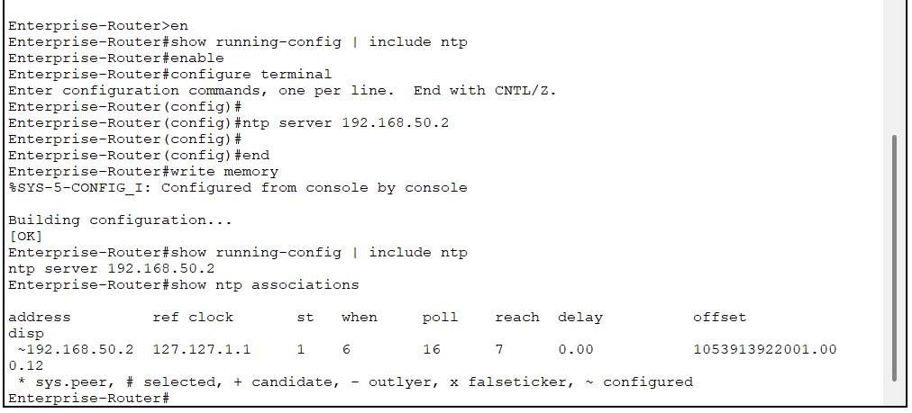
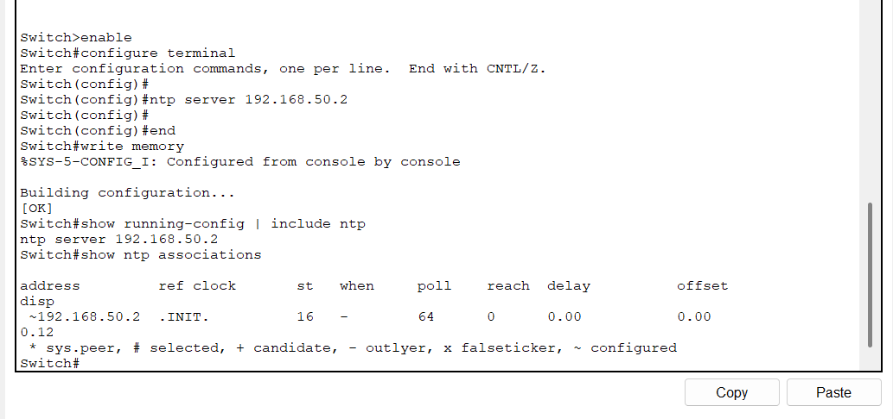
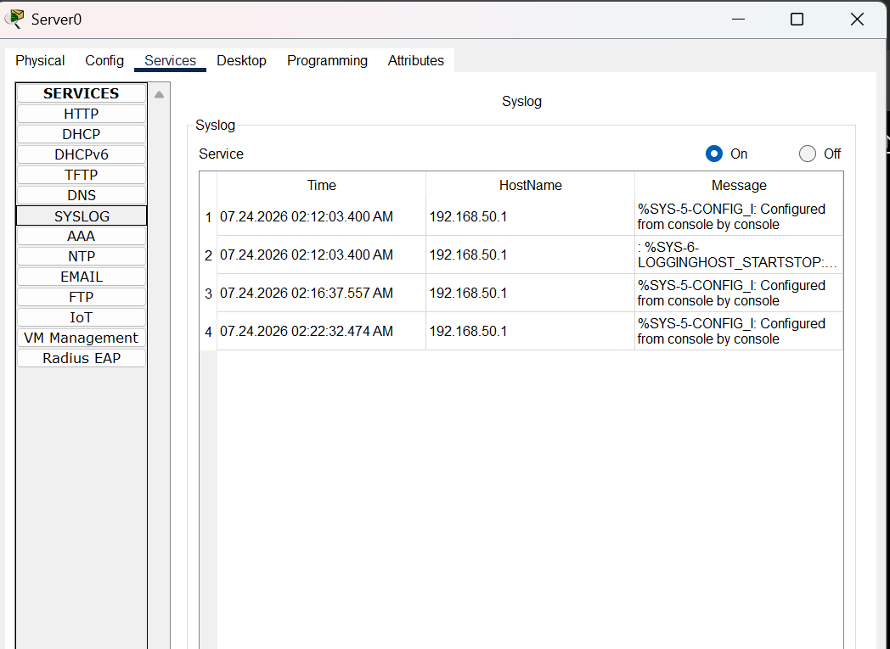
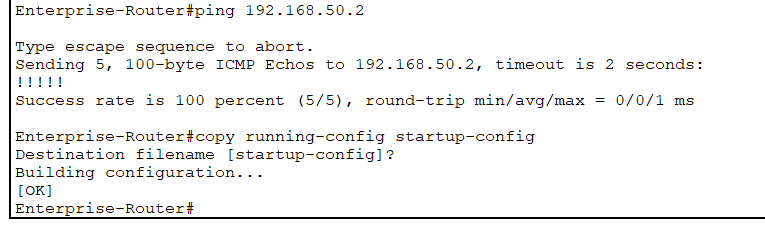
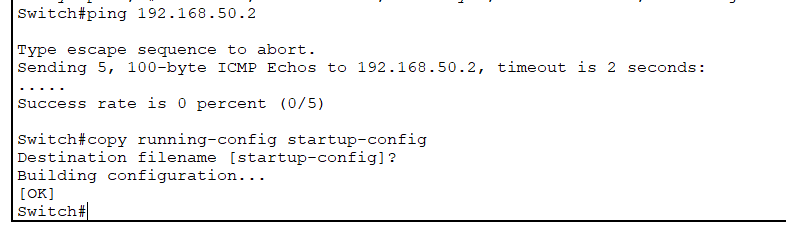
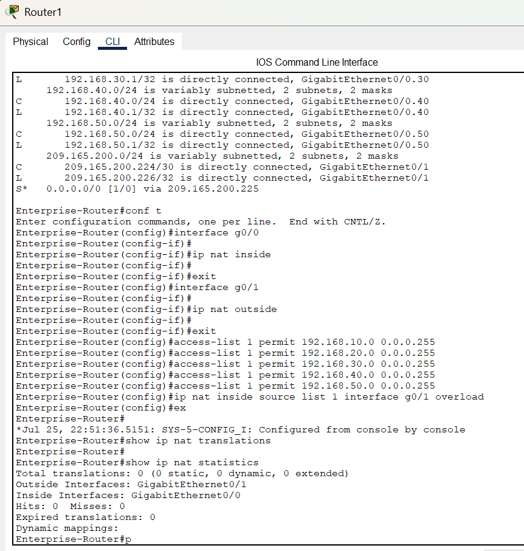
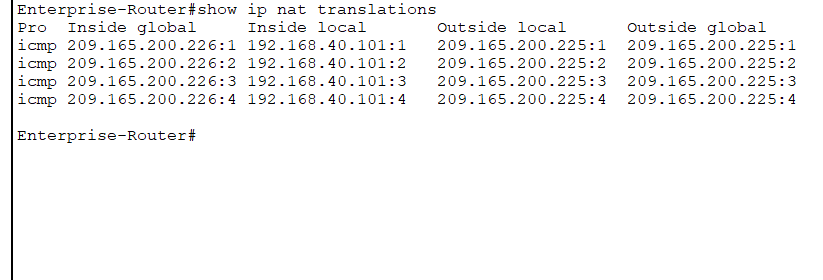
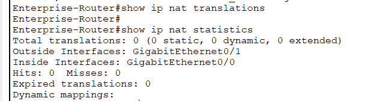
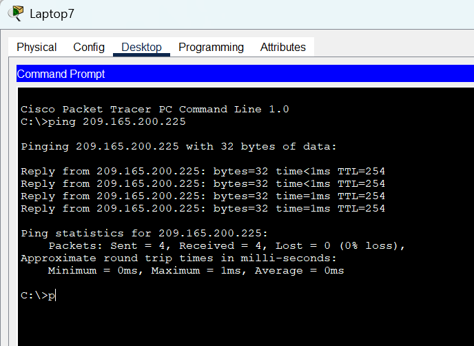

# Enterprise Network Infrastructure


🚧 **Current Status**

🎉 Project Status: All Planned Phases Completed

✅ Phase 1 – VLAN Segmentation

✅ Phase 2 – Inter-VLAN Routing

✅ Phase 3 – Enterprise Services

✅ Phase 4 – Network Security

✅ Phase 5 – Switch Hardening

✅ Phase 6 – Syslog & NTP

✅ Phase 7 – NAT & Internet Connectivity

📘 Final Documentation Complete


## Table of Contents

- [Overview](#overview)
- **[Quick Start](#quick-start)**
- [Business Requirements](#business-requirements)
- [Business Scenario](#business-scenario)
- [Network Design Goals](#network-design-goals)
- [Project Timeline](#project-timeline)
- [Design Decisions](#design-decisions)
- [Prerequisites](#prerequisites)
- [Enterprise Network Summary](#enterprise-network-summary)
- [Project Objectives](#project-objectives)
- [Architecture Overview](#architecture-overview)
- [Network Diagram](#final-enterprise-network-architecture)
- [Topology Highlights](#topology-highlights)
- [Network Services](#network-services)
- [Network Topology](#network-topology)
- [IP Addressing Scheme](#ip-addressing-scheme)
- [Technologies Used](#technologies-used)
- [Repository Structure](#repository-structure)
- **[Getting Started](#getting-started)**
- [Key Achievements](#key-achievements)
- [Features Implemented](#features-implemented)
- [Testing & Verification](#testing--verification)
- [Troubleshooting](#troubleshooting)
- [Project Completion Checklist](#Project-completion-checklist)
- [Lessons Learned](#lessons-learned)
- [Skills Demonstrated](#skills-demonstrated)
- [Skills Mapped to Industry](#skills-mapped-to-industry)
- [Configuration Highlights](#configuration-highlights)
- [Verification Commands](#verification-commands)
- [Implementation Screenshots](#implementation-screenshots)
- [Project Metrics](#project-metrics)
- [Security Features](#security-features)
- [Security Architecture](#security-architecture)
- [Switch Hardening](#switch-hardening)
- [Syslog & NTP](#syslog-&-ntp)
- [Future Enhancements](#future-enhancements)
- [Conclusion](#conclusion)
- [Project Outcomes](#project-outcomes)
- [Learning Resources](#learning-resources)
- [References](#references)
- [Acknowledgements](#acknowledgements)
- [Disclaimer](#disclaimer)
- [Author](#author)
- [License](#license)


## Overview

This project demonstrates the design and implementation of a secure enterprise network infrastructure using Cisco Packet Tracer. It showcases network segmentation, inter-VLAN routing, centralized network services, and foundational security controls commonly used in enterprise environments.

The objective is to build a secure and scalable network that supports multiple departments through VLAN segmentation and Inter-VLAN Routing.


## Executive Summary

This project simulates the deployment of a secure enterprise network for a medium-sized organization. The implementation includes VLAN segmentation, centralized network services, secure remote management, Layer 2 hardening, centralized logging, time synchronization, and Internet access through NAT Overload. The project was completed in Cisco Packet Tracer using Cisco IOS best practices.


## Quick Start

1. Clone the repository.
2. Open `Enterprise-Network-Infrastructure.pkt` using Cisco Packet Tracer 8.2.2 or later.
3. Allow the topology to initialize.
4. Verify DHCP, DNS, HTTP, FTP, SSH, ACLs, Syslog, NTP, and NAT.
5. Review the screenshots and configuration files for implementation details.


## Business Requirements

The enterprise required:

- Departmental isolation
- Secure remote administration
- Centralized IP address management
- Internal DNS services
- Secure Internet access
- Centralized logging
- Time synchronization
- Controlled inter-department communication


## Business Scenario

A growing enterprise requires a secure and scalable network to support multiple departments while maintaining centralized services and controlled communication between business units.

This project addresses those requirements by implementing:

- VLAN segmentation
- Inter-VLAN Routing
- Enterprise DHCP and DNS services
- Secure SSH remote administration
- Standard and Extended ACLs
- Centralized web and file services

The resulting design improves scalability, security, and manageability while reflecting networking practices commonly used in enterprise environments.


## Network Design Goals

The enterprise network was designed with the following objectives:

- Scalability for future departmental growth
- Secure segmentation through VLANs
- Centralized network services
- Secure remote administration
- Controlled inter-department communication
- Simplified troubleshooting and monitoring
- Internet connectivity using NAT Overload (PAT)

## Project Timeline

| Phase | Description | Status |
|-------|-------------|:------:|
| 1 | VLAN Segmentation | ✅ |
| 2 | Inter-VLAN Routing | ✅ |
| 3 | Enterprise Services (DHCP, DNS, HTTP, FTP) | ✅ |
| 4 | Network Security (SSH, ACLs, Port Security) | ✅ |
| 5 | Switch Hardening | ✅ |
| 6 | Syslog & NTP | ✅ |
| 7 | NAT (PAT), Internet Connectivity & Documentation | ✅ |

## Design Decisions

Several design decisions were made to improve scalability, security, and maintainability:

- Router-on-a-Stick was selected due to the small network size.
- Each department was isolated into its own VLAN.
- Centralized services were placed in a dedicated Server VLAN.
- DHCP Relay was used instead of multiple DHCP servers.
- SSH replaced Telnet for secure remote management.
- ACLs were applied to enforce departmental security policies.
- Port Security was configured to prevent unauthorized endpoint connections.
- Centralized Syslog was deployed for enterprise log collection and monitoring.
- NTP was configured to synchronize time across all network devices for consistent logging.
- NAT Overload (PAT) was implemented to allow multiple internal VLANs to securely share a single public IP address for external communication.
- Static routing was used between the Enterprise Router and the ISP Router to simulate Internet connectivity.
- NAT was configured on the physical inside interface (GigabitEthernet0/0) because all VLAN subinterfaces inherit the NAT inside designation in the Router-on-a-Stick architecture used in Cisco Packet Tracer.

## Prerequisites

To explore or replicate this project, you should have:

- Cisco Packet Tracer 8.2.2 or later
- Basic understanding of IPv4 addressing
- Familiarity with Cisco IOS CLI
- Basic networking concepts (VLANs, Routing, DHCP)

## Enterprise Network Summary

This project simulates an enterprise network consisting of five departmental VLANs connected through Router on a Stick architecture. Core enterprise services, including DHCP, DNS, HTTP, FTP, SSH, and Access Control Lists (ACLs), were implemented to provide centralized management, secure communication, and controlled network access.

The project follows industry best practices for network segmentation, service deployment, and security while demonstrating practical Cisco IOS configuration and troubleshooting skills.

## Project Objectives

- Design an enterprise network topology
- Implement VLAN segmentation
- Configure Router-on-a-Stick
- Enable Inter-VLAN Routing
- Verify connectivity between departments
- Document network configurations and testing

## Architecture Overview

The enterprise network consists of a Cisco 2911 router connected to a Catalyst 2960 switch using IEEE 802.1Q trunking. Five VLANs provide logical segmentation for departmental traffic, while centralized services (DHCP, DNS, HTTP, and FTP) are hosted within a dedicated Server VLAN. Inter-VLAN communication is enabled through Router-on-a-Stick, and multiple security mechanisms—including ACLs, SSH, and Port Security—protect both management access and endpoint connectivity.

## Network Diagram


## Short Architecture Diagram Explanation

User devices connect to the Catalyst 2960 access switch. The switch trunks traffic to the Cisco 2911 router, which performs inter-VLAN routing using Router-on-a-Stick. Enterprise services are hosted in a dedicated Server VLAN, while NAT and static routing provide simulated Internet connectivity through an ISP router.


## Topology Highlights

- 5 Departmental VLANs
- Router-on-a-Stick Architecture
- 1 Enterprise Router
- 1 ISP Router
- Cisco Catalyst 2960 Switch
- Centralized Server VLAN
- DHCP Relay
- Static Default Route to ISP
- NAT Overload (PAT)
- SSH Management
- ACL-based Traffic Filtering


## Network Services

| Service | Purpose |
|---------|---------|
| DHCP | Automatic IP address allocation |
| DNS | Internal hostname resolution |
| HTTP | Internal web application hosting |
| FTP | File transfer services |
| SSH | Secure remote device administration |
| Syslog	| Centralized log collection |
| NTP	| Network-wide time synchronization |
| NAT/PAT | Internet access using a single public IP |

## Network Topology

Departments included:

| VLAN | Department | Network         | Gateway      |
| ---- | ---------- | --------------- | ------------ |
| 10   | Admin      | 192.168.10.0/24 | 192.168.10.1 |
| 20   | Finance    | 192.168.20.0/24 | 192.168.20.1 |
| 30   | HR         | 192.168.30.0/24 | 192.168.30.1 |
| 40   | IT         | 192.168.40.0/24 | 192.168.40.1 |
| 50   | Servers    | 192.168.50.0/24 | 192.168.50.1 |

## IP Addressing Scheme

| Device/Network | IP Address |
|---------------|------------|
| Router VLAN 10 Gateway | 192.168.10.1 |
| Router VLAN 20 Gateway | 192.168.20.1 |
| Router VLAN 30 Gateway | 192.168.30.1 |
| Router VLAN 40 Gateway | 192.168.40.1 |
| Router VLAN 50 Gateway | 192.168.50.1 |
| Enterprise Server  | 192.168.50.2 |
| DHCP Scope VLAN 10 | 192.168.10.100-199 |
| DHCP Scope VLAN 20 | 192.168.20.100-199 |
| DHCP Scope VLAN 30 | 192.168.30.100-199 |
| DHCP Scope VLAN 40 | 192.168.40.100-199 |

## Technologies Used

• Cisco Packet Tracer 8.2.2
• Syslog
• Network Time Protocol (NTP)

### Hardware

- Cisco 2911 Router
- Cisco Catalyst 2960 Switch

### Layer 2 Technologies

- VLAN Segmentation
- IEEE 802.1Q Trunking
- Port Security

### Layer 3 Technologies

- Router-on-a-Stick
- Inter-VLAN Routing
- Static Routing
- NAT Overload (PAT)

### Network Services

- DHCP
- DHCP Relay
- DNS
- HTTP
- FTP

### Security

- SSH Version 2
- RSA Encryption
- Standard ACLs
- Extended ACLs
- Port Security
- Switch Hardening

## Repository Structure

```
Enterprise-Network-Infrastructure/
│
├── README.md
├── LICENSE
│
├── Documentation/
│   ├── Enterprise-Network-Report.pdf
│   ├── Network-Design-Notes.pdf
│   └── Project-Documentation.pdf
│
├── PacketTracer/
│   └── Enterprise-Network-Infrastructure.pkt
│
├── Configurations/
│   ├── router-config.txt
│   ├── switch-config.txt
│   └── isp-router-config.txt
│
├── Screenshots/
│   ├── final-enterprise-network-architecture.png
│   ├── vlan-creation-and-configuration.png
│   ├── ssh-login.png
│   ├── show-ip-nat-translations.png
│   ├── vlan-trunk-configuration.png
│   ├── dhcp-server-configuration.png
│   ├── dns-service-enabled-record.png
│   ├── http-homepage.png
│   ├── web-server-test.png
│   ├── ftp-user-authentication.png
│   ├── ssh-login.png
│   ├── ssh-configuration.png
│   ├── rsa-key-generation.png
│   ├── acl-configuration.png
│   ├── extended-acl-verification.png
│   ├── show-extended-acl.png
│   ├── show-access-lists.png
│   ├── show-port-security.png
│   ├── show-port-security-address.png
│   ├── show-port-security-interface-fa01.png
│   ├── ping-report-after-disconnecting-admin-pc.png
│   ├── show-spanning-tree-summary.png
│   ├── show-bpduguard.png
│   ├── show-portfast.png
│   ├── show-unused-ports.png
│   ├── show-logging.png
│   ├── syslog-server-log.png
│   ├── show-ntp-status-router.png
│   ├── show-ntp-status-switch.png
│   ├── show-clock-router.png
│   ├── show-clock-switch.png
│   ├── entnet-conf-ipnat-acl.png
│   ├── show-ip-nat-translations.png
│   ├── show-ipnat-stat.png
│   └── ping-isp-success.png
```

## Getting Started

### Installation

Clone the repository:

```bash
git clone https://github.com/oluwatobilobacybers-lang/Enterprise-Network-Infrastructure.git
```

### Setup

1. Open the project using **Cisco Packet Tracer 8.2.2** or later.
2. Open `Enterprise-Network-Infrastructure.pkt`.
3. Allow all devices to finish booting.

### Verification

Verify the network by performing the following tests:

- Ping between VLANs.
- Verify DHCP address assignment.
- Test DNS hostname resolution.
- Browse the internal web server.
- Connect to the FTP server.
- Establish an SSH session to the Enterprise Router.
- Verify NAT using the following Cisco IOS commands:

```cisco
show ip nat translations
show ip nat statistics
```

Finally, review the screenshots in the `Screenshots/` directory for implementation and configuration verification.


## Key Achievements

- Designed and deployed a segmented enterprise network supporting five business departments.
- Implemented centralized DHCP, DNS, HTTP, and FTP services.
- Secured remote administration using SSH Version 2 with RSA encryption.
- Implemented Standard and Extended ACLs to enforce enterprise security policies.
- Successfully validated Layer 2, Layer 3, and enterprise network services through comprehensive connectivity, routing, and security testing.
- Hardened the enterprise switch using Cisco Layer 2 security best practices including PortFast, BPDU Guard, Management VLAN, and unused port protection.
- Implemented centralized Syslog logging for enterprise network monitoring.
- Configured Network Time Protocol (NTP) to synchronize router and switch clocks.
- Validated synchronized timestamps across network devices to improve troubleshooting accuracy and support future security monitoring.
- Successfully implemented NAT Overload (PAT) to provide Internet connectivity for all internal VLANs.
- Verified dynamic address translation using Cisco IOS NAT verification commands.

## Features Implemented

- VLAN segmentation (VLANs 10, 20, 30, 40 and 50)
- Router-on-a-Stick (Inter-VLAN Routing)
- IEEE 802.1Q Trunk Configuration
- Enterprise DHCP Server
- DHCP Relay using `ip helper-address`
- Enterprise DNS Server
- Internal HTTP Web Server
- Enterprise FTP Server
- FTP User Authentication
- Secure Shell (SSH) Remote Management
- RSA Key Generation
- SSH Version 2
- Local User Authentication
- Secure VTY Configuration
- Standard Access Control Lists (ACLs)
- Inter-VLAN Traffic Filtering
- Department-Based Access Control
- Extended Access Control Lists (ACLs)
- Protocol-specific traffic filtering
- Switch Port Security
- Sticky MAC Address Learning
- MAC Address Limiting
- Violation Protection (Restrict Mode)
- Switch Hardening
- Disabled Unused Switch Ports
- Dedicated Unused VLAN (VLAN 999)
- PortFast Configuration
- BPDU Guard Protection
- Administrative Port Shutdown
- Management VLAN
- Centralized Syslog Server
- Remote Logging
- Network Time Protocol (NTP)
- Time Synchronization
- Enterprise Log Management
- Static Routing
- NAT Overload (PAT)
- Public IP Address Translation
- Internet Connectivity Simulation
- Dynamic NAT Translation Verification

## Testing & Verification

The following tests were successfully completed:
- Verified communication between devices within the same VLAN.
- Verified Inter-VLAN Routing between all departments.
- Confirmed DHCP automatic IP address assignment.
- Verified DNS hostname resolution.
- Successfully accessed the internal web server using both IP address and DNS hostname.
- Successfully authenticated to the FTP server from multiple VLANs.
- Successfully established encrypted SSH remote access using a local administrator account.
- Verified SSH Version 2 configuration and RSA key generation.
- Confirmed Standard ACL functionality by restricting Finance VLAN access to the HR VLAN.
- Verified authorized traffic continued to pass after ACL implementation.
- Verified Extended ACLs by restricting specific application traffic while allowing authorized communication between departments.
- Verified Port Security by confirming Sticky MAC address learning, maximum MAC address limits, violation mode, and restricted access for unauthorized devices.
- Verified PortFast was enabled on all access ports.
- Verified BPDU Guard protection on access interfaces.
- Confirmed unused interfaces were assigned to VLAN 999.
- Verified unused interfaces were administratively shut down.
- Verified successful Syslog message delivery from the router and switch.
- Confirmed log entries were recorded on the centralized Syslog server.
- Verified router clock synchronization using NTP.
- Verified switch clock synchronization using NTP.
- Confirmed consistent timestamps across network devices.
- Verified successful NAT translation from private to public IP addresses.
- Confirmed Internet-bound traffic from multiple VLANs.
- Verified PAT functionality using dynamic NAT translation tables.
- Validated static routing between the Enterprise Router and ISP Router.
  
## Troubleshooting

### Issue: Server VLAN (VLAN 50) Connectivity

During the implementation of the Server VLAN (VLAN 50), connectivity between the router and the server initially failed.

#### Root Cause

Although VLAN 50 had been created and assigned to the server access port (Fa0/9), it was not included in the list of VLANs allowed across the trunk link between the switch and the router.

#### Resolution

The issue was resolved by updating the trunk configuration:

```bash
interface GigabitEthernet0/1
switchport trunk allowed vlan add 50
```

After verifying the trunk configuration, connectivity between the router and the server was successfully restored.

#### Verification

- Successfully pinged the server (192.168.50.2) from the router.
- Successfully pinged the server from devices in other VLANs.
- Confirmed VLAN 50 was active and forwarding on the trunk link using:

```bash
show interfaces trunk
```

### Issue: NAT Translations Not Appearing

After configuring NAT overload, the command "show ip nat translations" returned no translations, even though the NAT configuration appeared correct.

#### Root Cause

During testing, the replacement PC in the Admin VLAN retained an incorrect manual IP configuration after an earlier project phase. Because the device had not obtained a valid address from the enterprise DHCP server, no qualifying outbound traffic was generated, preventing NAT translations from being created.

#### Resolution

The issue was resolved by:

- Renewing the PC's IP configuration using DHCP
- Verifying the PC received a valid IP address from the enterprise DHCP server
- Outbound traffic by pinging the ISP router
- Confirming NAT translations were successfully created

#### Verification

```text
Enterprise-Router# show ip nat translations

Pro  Inside global       Inside local        Outside global
icmp 209.165.200.226     192.168.40.101      209.165.200.225
```

Successful NAT translations confirmed that Port Address Translation (PAT) was functioning correctly.


## Project Completion Checklist

- [x] VLAN Segmentation
- [x] Inter-VLAN Routing
- [x] Server VLAN
- [x] DHCP
- [x] DNS
- [x] HTTP Server
- [x] FTP Server
- [x] SSH
- [x] Standard ACLs
- [x] Extended ACLs
- [x] Port Security
- [x] Switch Hardening
- [x] Syslog
- [x] NTP
- [x] NAT
- [x] Final Documentation

## Lessons Learned

This project strengthened my understanding of:
- VLAN segmentation and network design.
- Router-on-a-Stick configuration.
- IEEE 802.1Q trunking.
- Systematic troubleshooting using Cisco IOS verification commands.
- The importance of validating configurations before making changes.
- Learned how DHCP works in enterprise networks.
- Configured a centralized DHCP server for multiple VLANs.
- Used DHCP Relay (`ip helper-address`) to forward DHCP requests across VLANs.
- Verified automatic IP assignment and successful inter-VLAN communication.
- Configured an enterprise DNS server.
- Created DNS A records for internal services.
- Verified hostname resolution from client PCs.
- Learned how DNS integrates with DHCP to provide automatic name resolution.
- Configured an enterprise HTTP server.
- Created and deployed a custom HTML homepage.
- Verified web access using both IP address and DNS hostname.
- Understood the relationship between DNS and HTTP services.
- Learned how FTP provides centralized file transfer services in enterprise networks.
- Configured and tested FTP user authentication.
- Observed that Cisco Packet Tracer simulates FTP functionality but has limitations compared to production FTP servers.
- Configured Secure Shell (SSH) for encrypted remote device management.
- Generated RSA keys to secure remote administrative access.
- Configured local user authentication for privileged access.
- Restricted VTY lines to SSH, eliminating insecure Telnet access.
- Verified successful remote login using SSH.
- Configured Standard Access Control Lists to restrict inter-VLAN communication.
- Applied ACLs to router subinterfaces to enforce security policies.
- Verified access restrictions through connectivity testing.
- Learned the difference between Standard and Extended ACLs.
- Applied Extended ACLs to filter traffic based on source, destination, and protocol.
- Understood the importance of placing Extended ACLs close to the traffic source.
- Configured Port Security to restrict unauthorized devices.
- Learned Sticky MAC address learning.
- Verified violation counters using show port-security.
- Understood Restrict, Protect and Shutdown violation modes.
- Implemented Layer 2 switch hardening using Cisco best practices.
- Learned the importance of disabling unused switch ports.
- Configured PortFast to reduce access-port startup delays.
- Enabled BPDU Guard to protect against rogue switches.
- Implemented a dedicated Management VLAN for improved administrative security.
- Configured centralized Syslog for enterprise event logging.
- Learned the importance of centralized logging for troubleshooting and incident investigation.
- Configured Network Time Protocol (NTP) for consistent timestamps across network devices.
- Understood why synchronized time is essential for security monitoring and log correlation.
- Implemented Network Address Translation (NAT Overload) to allow multiple private networks to share a single public IP address.
- Configured static routing between the enterprise network and a simulated ISP.
- Verified NAT translations using Cisco IOS verification commands.
- Troubleshot a connectivity issue caused by a replacement PC that had not obtained an IP address via DHCP, reinforcing the importance of validating end-host configuration during network troubleshooting.
- Learned that NAT translations are created only after matching traffic traverses the router.
- Verified that correct end-host IP addressing obtained through DHCP is essential for successful NAT operation.

## Skills Demonstrated

- Enterprise Network Design
- VLAN Segmentation
- Layer 2 Switching
- Layer 3 Routing
- Inter-VLAN Routing
- DHCP Configuration
- DNS Configuration
- Web Server Deployment
- FTP Configuration
- Network Troubleshooting
- Cisco IOS Configuration
- Technical Documentation
- Access Control Lists (ACLs)
- Network Access Control
- Enterprise Security Policy Implementation
- SSH Configuration
- Secure Remote Administration
- Extended Access Control Lists
- Traffic Filtering
- Cisco IOS Security
- Enterprise Network Security
- Network Documentation
- Layer 2 Security
- Switch Security
- Cisco Port Security
- Switch Hardening
- Spanning Tree Protocol (STP)
- Layer 2 Hardening
- BPDU Guard
- PortFast Configuration
- Syslog Configuration
- Network Monitoring
- Enterprise Logging
- Log Management
- Network Time Protocol (NTP)
- Cisco Infrastructure Management
- Enterprise Monitoring
- Cisco Infrastructure Monitoring
- Time Synchronization
- Network Address Translation (NAT)
- Port Address Translation (PAT)
- Internet Edge Routing
- Static Routing

## Skills Mapped to Industry

| Technology        | Industry Skill                     |
| ----------------- | ---------------------------------- |
| VLANs             | Network Segmentation               |
| Router-on-a-Stick | Layer 3 Routing                    |
| DHCP              | IP Address Management              |
| DNS               | Enterprise Infrastructure Services |
| SSH               | Secure Remote Administration       |
| ACLs              | Network Access Control             |
| Port Security     | Layer 2 Security                   |
| Syslog            | Security Monitoring                |
| NTP               | Log Correlation                    |
| NAT/PAT           | Internet Edge Security             |
| Static Routing    | WAN Connectivity                   |
| Cisco IOS         | Network Device Administration      |


## Configuration Highlights

### Layer 2 Configuration

### VLAN Configuration

```cisco
vlan 10
 name Admin

vlan 20
 name Finance

vlan 30
 name HR

vlan 40
 name IT

vlan 50
 name Servers
```

### Trunk Configuration

```cisco
interface GigabitEthernet0/1
 switchport mode trunk
 switchport trunk allowed vlan 10,20,30,40,50
```

### Port Security

```cisco
interface FastEthernet0/1
 switchport mode access
 switchport port-security
 switchport port-security maximum 1
 switchport port-security mac-address sticky
 switchport port-security violation restrict
```

### Layer 3 Configuration

### Router-on-a-Stick

```cisco
interface GigabitEthernet0/0.10
 encapsulation dot1Q 10
 ip address 192.168.10.1 255.255.255.0

interface GigabitEthernet0/0.20
 encapsulation dot1Q 20
 ip address 192.168.20.1 255.255.255.0
```

### DHCP Relay

```cisco
interface GigabitEthernet0/0.10
 ip helper-address 192.168.50.2

interface GigabitEthernet0/0.20
 ip helper-address 192.168.50.2

interface GigabitEthernet0/0.30
 ip helper-address 192.168.50.2

interface GigabitEthernet0/0.40
 ip helper-address 192.168.50.2
```

### Security Configuration

### SSH Configuration

```cisco
hostname Enterprise-Router
ip domain-name enterprise.local

crypto key generate rsa

username admin privilege 15 secret ********

line vty 0 4
 login local
 transport input ssh
```

### Standard ACL

```cisco
access-list 10 deny 192.168.20.0 0.0.0.255
access-list 10 permit any
```

### Extended ACL

```cisco
ip access-list extended BLOCK_HTTP
 deny tcp 192.168.20.0 0.0.0.255 host 192.168.50.2 eq 80
 permit ip any any
```

### Switch Hardening

The switch was hardened using Cisco Layer 2 security best practices to reduce the attack surface, protect against unauthorized devices, and improve overall network resilience.

```cisco
spanning-tree portfast default
spanning-tree portfast bpduguard default

interface range FastEthernet0/10-24
 switchport mode access
 switchport access vlan 999
 shutdown
 description UNUSED_PORT

interface FastEthernet0/1
 spanning-tree portfast
 spanning-tree bpduguard enable
```

### Syslog Configuration

Configured remote Syslog logging to forward device log messages to the centralized Syslog server. Log timestamps were enabled to improve troubleshooting, event correlation, and security monitoring.

```cisco
logging 192.168.50.2
logging trap informational
service timestamps log datetime msec
```

### Network Time Protocol (NTP)

#### Router

```cisco
ntp master 1
ntp update-calendar
```

#### Switch

```cisco
ntp server 192.168.50.1
clock timezone WAT 1
```

### NAT Configuration

```cisco
interface GigabitEthernet0/0
 ip nat inside

interface GigabitEthernet0/1
 ip nat outside

access-list 1 permit 192.168.10.0 0.0.0.255
access-list 1 permit 192.168.20.0 0.0.0.255
access-list 1 permit 192.168.30.0 0.0.0.255
access-list 1 permit 192.168.40.0 0.0.0.255
access-list 1 permit 192.168.50.0 0.0.0.255

ip nat inside source list 1 interface GigabitEthernet0/1 overload
```

> **Note:** In this Router-on-a-Stick topology, `ip nat inside` is applied to the physical interface (`GigabitEthernet0/0`). All VLAN subinterfaces (GigabitEthernet0/0.10, .20, .30, .40, and .50) inherit the inside NAT designation, which is the expected behavior in Cisco Packet Tracer.


## Verification Commands

The following Cisco IOS commands were used to verify the network configuration:

```cisco
show vlan brief
show interfaces trunk
show interfaces status

show ip interface brief
show ip route

show ip dhcp binding
show ip dhcp pool

show access-lists

show ssh
show users

show port-security
show port-security interface fa0/1
show port-security address

show spanning-tree summary
show spanning-tree interface fa0/1 detail

show logging

show ntp status
show ntp associations

show clock

show running-config

show ip nat translations
show ip nat statistics
show ip route
```

## Implementation Screenshots

### Final Enterprise Network Topology

The completed enterprise network consists of five departmental VLANs connected through Router-on-a-Stick architecture, centralized enterprise services, an ISP router for Internet simulation, Syslog, NTP, and NAT Overload (PAT).


### VLAN Configuration


### Trunk Configuration


### DNS Configuration


### DHCP Configuration


### Enterprise Web Server Configuration


### FTP Authentication


### SSH Login


### SSH Configuration


### RSA Key Generation


### ACL Configuration


### Extended ACL Verification


### Show Extended ACL Verification


### Show Access Lists


### Port Security Verification

Port Security was verified using Cisco IOS verification commands to confirm secure MAC address learning, configured maximum MAC addresses, violation mode, and interface protection after connecting an unauthorized device.


### Switch Hardening Verification

The switch hardening configuration was verified by confirming that PortFast and BPDU Guard were enabled globally, unused interfaces were assigned to VLAN 999 and administratively shut down, and spanning-tree settings were successfully applied.


The screenshots above validate that Layer 2 hardening was successfully implemented using PortFast, BPDU Guard, and secure handling of unused interfaces.

### Syslog & NTP Verification

### Syslog Configuration & Router NTP Status



### Syslog Configuration & Switch NTP Status



### Syslog Server Logs



### Router NTP Verification



### Switch NTP Verification



### NAT (PAT) Verification

### NAT Configuration



### NAT Translation Table



### NAT Statistics



### Internet Connectivity Test




## Project Metrics

| Item                      | Count |
| ------------------------- | ----: |
| VLANs                     | 5 |
| Router                    | 2 |
| Switches                  | 1 |
| PCs                       | 8 |
| Servers                   | 1 |
| Network Services          | 8 |
| Routing Technologies      | 3 |
| Security Technologies     | 16 |
| Hardening Techniques      | 7 |


## Security Features

The following security mechanisms have been implemented:

- VLAN Segmentation
- Standard ACLs
- Extended ACLs
- SSH Version 2
- RSA Key Encryption
- Local User Authentication
- Secure VTY Access
- Telnet Disabled
- Department-Based Traffic Filtering
- Port Security
- Sticky MAC Address Learning
- MAC Address Limiting
- Unauthorized Device Protection
- Switch Hardening
- PortFast
- BPDU Guard
- Unused Port Hardening
- Management VLAN
- Centralized Syslog
- Remote Log Collection
- NAT Overload (PAT)
- Public IP Address Translation
- Internet Edge Protection


## Security Architecture

The network adopts a defense-in-depth security model by implementing complementary security controls at multiple layers of the network, including Layer 2 switching and Layer 3 routing. Network segmentation, traffic filtering, secure device management, and endpoint protection work together to reduce the attack surface and mitigate unauthorized access.

Implemented security technologies include:

| Security Technology         | Purpose |
|---------------------        |---------|
| VLAN Segmentation           | Isolates departmental traffic |
| Standard ACLs               | Restricts network access between VLANs |
| Extended ACLs               | Filters traffic by protocol, source, and destination |
| SSH Version 2               | Provides encrypted remote administration |
| RSA Encryption              | Secures SSH key exchange |
| Local User Authentication   | Restricts administrative access |
| Secure VTY Configuration    | Disables Telnet and permits SSH only |
| Port Security               | Prevents unauthorized endpoint connections |
| Sticky MAC Address Learning | Dynamically learns and secures trusted devices |
| PortFast	                  | Reduces access-port startup delay |
| BPDU Guard                  | Protects against rogue switches and STP attacks |
| Unused Port Hardening       | Disables unused interfaces to reduce the attack surface |
| Management VLAN	          | Separates management traffic from user traffic |
| Syslog	| Centralized log collection |
| NTP	| Time synchronization for accurate log correlation |
| NAT Overload (PAT)  | Hides internal private addresses behind a single public IP |


These layered controls help reduce unauthorized access while protecting enterprise resources.


## Switch Hardening

To strengthen Layer 2 security, several switch hardening measures were implemented following Cisco best practices.

Implemented controls include:

- Disabled unused switch ports
- Assigned unused interfaces to VLAN 999
- Administratively shut down unused interfaces
- Enabled PortFast on access ports
- Enabled BPDU Guard to protect against rogue switches
- Configured a dedicated Management VLAN

These controls reduce the attack surface, prevent unauthorized physical access, and improve the resilience of the enterprise switching infrastructure.

## Syslog & NTP

To improve enterprise monitoring and operational consistency, centralized logging and time synchronization were implemented across the network.

Implemented controls include:

- Centralized Syslog server
- Remote logging from router and switch
- Network Time Protocol (NTP)
- Consistent timestamps across network devices
- Improved troubleshooting and event correlation

These controls provide better visibility into network events, simplify troubleshooting, and ensure accurate log timestamps for security monitoring and incident investigations.


## Future Enhancements

Potential improvements for future versions include:

- Dynamic Routing (OSPF)
- Site-to-Site VPN
- GRE Tunnel
- Redundant Routers (HSRP)
- AAA Authentication (RADIUS/TACACS+)
- SNMP Monitoring
- NetFlow Traffic Analysis
- IPv6 Implementation
- Zone-Based Firewall

## Conclusion

This project demonstrates the end-to-end implementation of a secure enterprise network using Cisco Packet Tracer. It incorporates VLAN segmentation, Inter-VLAN Routing, centralized enterprise services, SSH, ACLs, Layer 2 hardening, Syslog, NTP, and NAT Overload (PAT) to simulate a modern enterprise network following industry best practices.

Throughout the project, I gained hands-on experience in network design, configuration, troubleshooting, and security while documenting each implementation phase using industry-standard practices.

The final phase extended the project by implementing NAT Overload (PAT) and Internet connectivity simulation, complementing the earlier implementation of centralized Syslog logging and NTP synchronization.


## Project Outcomes

✔ 5 VLANs deployed

✔ 100% Inter-VLAN connectivity

✔ Automated IP addressing

✔ Secure SSH administration

✔ Centralized logging

✔ Time synchronization

✔ Internet access via NAT

✔ Security policy enforcement through ACLs


## Learning Resources

This project was built by applying concepts learned through:

- Cisco Networking Training
- New Horizons System Solution Ltd
- CompTIA Network+
- CompTIA Security+
- TS Academy Cybersecurity Program

## References

- Cisco IOS Documentation
- Cisco Packet Tracer User Guide
- RFC 2131 – Dynamic Host Configuration Protocol (DHCP)
- RFC 1034 & RFC 1035 – Domain Name System (DNS)
- RFC 3022 – Traditional NAT


## Acknowledgements

I would like to thank the instructors and mentors at TS Academy and New Horizons Nigeria for providing the foundational networking and cybersecurity knowledge that contributed to this project. I also acknowledge the CompTIA Network+ and Security+ learning materials that reinforced the concepts applied throughout this implementation.

## Disclaimer

This project was developed in Cisco Packet Tracer for educational and portfolio purposes. While it demonstrates enterprise networking concepts and security best practices, certain behaviors may differ from production Cisco IOS devices.

## Author

**Banjo Oluwatobiloba Adekunle**

Cybersecurity Analyst | Network Security Enthusiast
ISC² Certified in Cybersecurity (CC)
CompTIA Security+
CEH Candidate

🔗 **LinkedIn:** https://www.linkedin.com/in/oluwatobiloba-banjo-b2368819b/

💻 **GitHub:** https://github.com/oluwatobilobacybers-lang


## License

This project is provided for educational and portfolio purposes.
